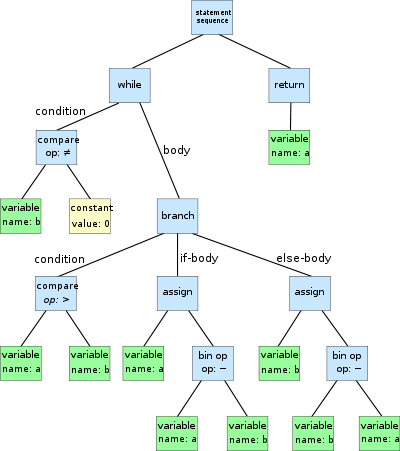

class: center, middle

# Functional Programing - Haskell, Clojure

---
class: center, middle
# Before we start


---
# Agenda
( for [Haskell Clojure]
1. Introduction
1. Adventages/disadventages
1. Applications of this language
1. Code sample
)

---
# Introduction

Haskell /ˈhæskəl/ is a
- standardized,
- general-purpose purely functional programming language, with
- non-strict semantics and
- strong static typing.
- cross-platform


---
# Introduction

Haskell /ˈhæskəl/ is
- a standardized,
- general-purpose purely functional programming language, with
- non-strict semantics and
- strong static typing.
- cross-platform

Haskell
- first appeared in 1990
- filename extensions `.hs .lhs`


- Is named after logician Haskell Curry.

---
# Adventages/disadventages
Advantages
- much faster in parallel operations than F# or Scala [:1](http://www.slideshare.net/pt114/haskell-vs-f-vs-scala)
- purely functional
- pattern matching
- lazy evaluation
- type classes

Disadvantages
- purely functional
- no really good IDE

---
# Applications

- [Pugs: Perl6 User's Golfing System](http://homepages.inf.ed.ac.uk/wadler/realworld/pugs.html)
- [HXML](http://homepages.inf.ed.ac.uk/wadler/realworld/hxml.html)
- [Swish: Semantic Web Inference Scripting in Haskell](http://homepages.inf.ed.ac.uk/wadler/realworld/swish.html)
- [Happy](http://homepages.inf.ed.ac.uk/wadler/realworld/happy.html)
- [Haskell Equational Reasoning Assistant](https://wiki.haskell.org/Haskell_Equational_Reasoning_Assistant)


---
# Code sample
```haskell
module Main where

main :: IO ()
main = putStrLn "Hello, World!"
```
---
# Code sample
```haskell
-- Type annotation (optional)
factorial :: (Integral a) => a -> a

-- Using recursion
factorial n | n < 2 = 1
factorial n = n * factorial (n - 1)

-- Using recursion, with guards
factorial n
  | n < 2     = 1
  | otherwise = n * factorial (n - 1)

-- Using recursion but written without pattern matching
factorial n = if n > 0 then n * factorial (n-1) else 1

-- Using a list
factorial n = product [1..n]

-- Using fold (implements product)
factorial n = foldl (*) 1 [1..n]

-- Point-free style
factorial = foldr (*) 1 . enumFromTo 1
```

---
# Code sample
```haskell
primes = sieve [2..]
  where sieve (p:xs) =
          p : sieve [x | x <- xs, x `mod` p /= 0]
```

---
# Haskell - try it
online
- [try Haskell](https://tryhaskell.org)

localy
- [Haskell Platform](https://www.haskell.org/platform/)

***
Docs
- [Learn you a Haskell](http://learnyouahaskell.com/) - good starting point (book)
- [Real World Haskell](http://book.realworldhaskell.org/read/) - another book
- [documentation for everything](https://www.haskell.org/documentation)

---
class: center, middle
# Clojure

---
# Clojure - Introduction

Clojure (pronounced like "closure") is
- a dialect of the Lisp programming language
- general-purpose programming language with an *emphasis* on functional programming

Clojure
- runs on the Java Virtual Machine, Common Language Runtime, and JavaScript engines.
- treats code as data and has a macro system.
- first appeared in 2007
- filename extensions `.clj .cljs .edn)`

---
# Clojure - Adventages/disadventages
Advantages
- have *emphasis* on functional programming
- works on JVM, CLR, JavaScript
- pattern matching
- macros
- closures

Disadvantages
- have *emphasis* on functional programming
- no pattern matching
- no really good IDE

???
CLR - .NET platform
---
# Clojure - Applications

---
# Clojure
.expresionResultTable[
|         expresion               |       result           |
|---------------------------------|------------------------|
|(+ 3 3)                          | 6
]
---
# Clojure
.expresionResultTable[
|         expresion               |       result           |
|---------------------------------|------------------------|
|(+ 3 3)                          | 6                      |
|(/ 10 3)                         | 10/3                   |
]
---
# Clojure
.expresionResultTable[
|         expresion               |       result           |
|---------------------------------|------------------------|
|(+ 3 3)                          | 6                      |
|(/ 10 3)                         | 10/3                   |
|(/ 10 3.0)                       | 3.3333                 |
]
---
# Clojure
.expresionResultTable[
|         expresion               |       result           |
|---------------------------------|------------------------|
|(+ 3 3)                          | 6                      |
|(/ 10 3)                         | 10/3                   |
|(/ 10 3.0)                       | 3.3333                 |
|(+ 1 2 3 4 5 6)                  | 21                     |
]
---
# Clojure
.expresionResultTable[
|         expresion               |       result           |
|---------------------------------|------------------------|
|(+ 3 3)                          | 6                      |
|(/ 10 3)                         | 10/3                   |
|(/ 10 3.0)                       | 3.3333                 |
|(+ 1 2 3 4 5 6)                  | 21                     |
|(defn square [x] (* x x))        | 'namespace/square      |
]
---
# Clojure
.expresionResultTable[
|         expresion               |       result           |
|---------------------------------|------------------------|
|(+ 3 3)                          | 6                      |
|(/ 10 3)                         | 10/3                   |
|(/ 10 3.0)                       | 3.3333                 |
|(+ 1 2 3 4 5 6)                  | 21                     |
|(defn square [x] (* x x))        | 'namespace/square      |
|(square 10)                      | 100                    |
]
---
# Clojure
.expresionResultTable[
|         expresion               |       result           |
|---------------------------------|------------------------|
|(+ 3 3)                          | 6                      |
|(/ 10 3)                         | 10/3                   |
|(/ 10 3.0)                       | 3.3333                 |
|(+ 1 2 3 4 5 6)                  | 21                     |
|(defn square [x] (* x x))        | 'namespace/square      |
|(square 10)                      | 100                    |
|
|(fn [x] (* x x))                 | 'namespace$eval*RndNr* |
]
---
# Clojure
.expresionResultTable[
|         expresion               |       result           |
|---------------------------------|------------------------|
|(+ 3 3)                          | 6                      |
|(/ 10 3)                         | 10/3                   |
|(/ 10 3.0)                       | 3.3333                 |
|(+ 1 2 3 4 5 6)                  | 21                     |
|**(defn square [x] (* x x))**    | 'namespace/square      |
|(square 10)                      | 100                    |
|
|(fn [x] (* x x))                 | 'namespace$eval*RndNr* |
|(def square (fn [x] (* x x)))    |'namespace/square       |
]
---
# Clojure - data structures
- Vectors: `[1 2 3 4]`
- Maps: `{:foo "bar" 3 4}`
- Sets: `#{1 2 3 4}`

---
# Clojure - data structures
- Vectors: `[1 2 3 4]`
- Maps: `{:foo "bar" 3 4}`
- Sets: `#{1 2 3 4}`

## **All data are immutable**

???
Vectors and lists are sequential and ordered collections. Sets are not ordered, and they cannot contain duplicate elements. Maps are key-value collections, where the keys can be any object. Here, we've used what Clojure calls a keyword (:foo) for one of the keys, and a number for the other key.

Now I'll tell you another thing that may surprise you: Clojure collections are immutable - they can never change. When you do anything on a list, including adding and removing elements, you actually get a brand new list. (Fortunately, Clojure is amazingly efficient at creating new lists). In general, Clojure encourages you to have as little mutable state as possible. For example, instead of "for" loops and other state-changing constructs, most of the time you'll see functions doing transformations on immutable data and returning new collections, without changing the old one.

---
# Clojure - higher order function
```clojure
(map inc [1 2 3 4])
```
???
A prime example of this is map. map is a higher order function, which means that it takes another function as an argument

---
# Clojure - flow control
```clojure
(if (> 13 5)
        do-something-if-true
        do-something-if-false)
```
---
# Clojure - flow control
```clojure
(if (> 13 5)
        do-something-if-true
        do-something-if-false)
```


```clojure
;; prepare a seq of the even values
;; from the first six multiples of three
(for [x [0 1 2 3 4 5]
      :let [y (* x 3)]
      :when (even? y)]
  y)
;;=> (0 6 12)
```

---
# Clojure - closure
```clojure
(defn pow [n]
   (fn [x] (apply * (repeat n x))))

(def sq (pow 2))
(def qb (pow 3))
```

---
# Clojure - polymorphism

> polymorphism is a programming language feature that allows values of different data types to be handled using a uniform interface
>> --<cite>Wikipedia</cite>
---
# Clojure - polymorphism

> polymorphism is a programming language feature that allows values of different data types to be handled using a uniform interface
>> --<cite>Wikipedia</cite>

```clojure
1 (defn convert [data]
2   (cond
3     (nil? data)
4       "null"
5     (string? data)
6       (str "\"" data "\"")
7     (keyword? data)
8       (convert (name data))
9     :else
10       (str data)))
```
---
# Clojure - polymorphism

> polymorphism is a programming language feature that allows values of different data types to be handled using a uniform interface
>> --<cite>Wikipedia</cite>

```clojure
1 (defmulti convert class)
2
3 (defmethod convert clojure.lang.Keyword [data]
4   (convert (name data)))
5
6 (defmethod convert java.lang.String [data]
7   (str "\"" data "\""))
8
9 (defmethod convert nil [data]
10   "null")
11
12 (defmethod convert :default [data]
13   (str data))
```

```clojure
14 (defmethod convert clojure.lang.PersistentVector [data]
15   (str "[" (join ", " (map convert data)) "]"))
```

---
# Clojure - polymorphism, hierarchy
Multimethods actually use the **isa?** function instead of the = function to match dispatch values to the correct method.
```clojure
1 (derive clojure.lang.PersistentVector ::collection)
2
3 (defmethod convert ::collection [data]
4   (str "[" (join ", " (map convert data)) "]"))
```

---
# Clojure - polymorphism, hierarchy
Multimethods actually use the **isa?** function instead of the = function to match dispatch values to the correct method.
```clojure
1 (derive clojure.lang.PersistentVector ::collection)
2
3 (defmethod convert ::collection [data]
4   (str "[" (join ", " (map convert data)) "]"))
```
```clojure
5 (derive clojure.lang.PersistentList ::collection)
```

---
# Clojure - polymorphism, hierarchy
Multimethods actually use the **isa?** function instead of the = function to match dispatch values to the correct method.
```clojure
1 (derive clojure.lang.PersistentVector ::collection)
2
3 (defmethod convert ::collection [data]
4   (str "[" (join ", " (map convert data)) "]"))
```
```clojure
5 (derive clojure.lang.PersistentList ::collection)
```
</br>
</br>
No need to define own hierarchies we can used build-in ones

```clojure
1 (defmethod convert clojure.lang.Sequential [data]
2   (str "[" (join ", " (map convert data)) "]"))
```

---
# Clojure - try it
online
- http://www.tryclj.com/ - online repl, with short tutorial
- http://www.4clojure.com/problems - tutorial in form of test driven development

localy
- http://leiningen.org/ -> Download the lein script (**or on Windows lein.bat**)
- https://sekao.net/nightcode/ - IDE for clojure
- https://sekao.net/nightmod/ - IDE for writing games using clojure


***

Docs:
- http://clojure-doc.org/ -> Get Started!
- https://clojuredocs.org/clojure.core -> documentation
- for games
    - [play-clj](https://github.com/oakes/play-clj/blob/master/TUTORIAL.md)
    - [Nightmod](https://github.com/oakes/Nightmod)

---
class: center, middle
#Comparision
Abstract syntax tree example





---
#Comparision - clojure match
```clojure
(use '[clojure.core.match :only [match]])

(defn evaluate [env [sym x y]]
  (match [sym]
    ['Number]   x
    ['Add]      (+ (evaluate env x) (evaluate env y))
    ['Multiply] (* (evaluate env x) (evaluate env y))
    ['Variable] (env x)))

(def environment {"a" 3, "b" 4, "c" 5})

(def expression-tree '(Add (Variable "a") (Multiply (Number 2) (Variable "b"))))

(def result (evaluate environment expression-tree))
```

---
#Comparision - clojure protocol
```clojure
(defprotocol Expression
  (evaluate [e env] ))

(deftype Number1 [x])
(deftype Add [x y] )
(deftype Multiply [x y])
(deftype Variable [x])

(extend-protocol Expression
  Number1  (evaluate [e env] (.x e ) )
  Add      (evaluate [e env] (+ (evaluate (.x e) env) (evaluate (.y e) env)))
  Multiply (evaluate [e env] (* (evaluate (.x e) env) (evaluate (.y e) env)))
  Variable (evaluate [e env] (env (.x e))))

(def environment {"a" 3, "b" 4, "c" 5})  

(def expression-tree (Add. (Variable. "a") (Multiply. (Number1. 2) (Variable. "b"))))

(def result (evaluate expression-tree environment))
```

---
#Comparision - fsharp
```fsharp
//Here's some F# code...

type Expression =
    | Number of int
    | Add of Expression * Expression
    | Multiply of Expression * Expression
    | Variable of string

let rec Evaluate (env:Map<string,int>) exp =
    match exp with
    | Number n -> n
    | Add (x, y) -> Evaluate env x + Evaluate env y
    | Multiply (x, y) -> Evaluate env x * Evaluate env y
    | Variable id    -> env.[id]

let environment = Map.ofList [ "a", 1 ;
                               "b", 2 ;
                               "c", 3 ]

// Create an expression tree that represents
// the expression: a + 2 * b.
let expressionTree1 = Add(Variable "a", Multiply(Number 2, Variable "b"))

// Evaluate the expression a + 2 * b, given the
// table of values for the variables.
let result = Evaluate environment expressionTree1
```

---
#Comparision - Haskell case
```haskell
import Data.Map

data Expression =
    Number   Int
  | Add      Expression Expression
  | Multiply Expression Expression
  | Variable String

evaluate :: Map String Int -> Expression -> Int
evaluate env exp =
  case exp of
    Number x     -> x
    Add x y      -> evaluate env x + evaluate env y
    Multiply x y -> evaluate env x * evaluate env y
    Variable x   -> findWithDefault 0 x env

environment = fromList([("a",3), ("b",4), ("c",7)])

expressionTree = Add (Variable "a") (Multiply (Number 2) (Variable "b"))

result = evaluate environment expressionTree
```

---
#Comparision - Haskell constructor
```haskell
import Data.Map

data Expression =
    Number   Int
  | Add      Expression Expression
  | Multiply Expression Expression
  | Variable String

evaluate :: Map String Int -> Expression -> Int
evaluate env (Number x) = x
evaluate env (Add x y) = evaluate env x + evaluate env y
evaluate env (Multiply x y) = evaluate env x * evaluate env y
evaluate env (Variable x) = findWithDefault 0 x env

environment = fromList([("a",3), ("b",4), ("c",7)])

expressionTree = Add (Variable "a") (Multiply (Number 2) (Variable "b"))

result = evaluate environment expressionTree
```

---
#Comparision - ocaml
```ocaml
type expression =
    Number of int
  | Add of expression * expression
  | Multiply of expression * expression
  | Variable of string


let rec evaluate (env: string->int) exp =
  match exp with
      Number n -> n
    | Add (x, y) -> evaluate env x + evaluate env y
    | Multiply (x, y) -> evaluate env x * evaluate env y
    | Variable id    -> env id

let environment (str: string) : 'a = match str with "a" -> 3 | "b" -> 4 | "c" -> 5

let expressiontree1 = Add(Variable "a", Multiply(Number 2, Variable "b"))

let result = evaluate environment expressiontree1
```

---
#Comparision - scala
```scala
abstract class Expression

case class Number(i: Int) extends Expression
case class Add(x: Expression, y: Expression) extends Expression
case class Multiply(x: Expression, y: Expression) extends Expression
case class Variable(id: Symbol) extends Expression

object Maths extends App {
  val environment = Map('a -> 1,
      'b -> 2,
      'c -> 3)

  def evaluate(env: Map[Symbol, Int], exp: Expression): Int = exp match {
    case Number(n: Int) => n
    case Add(x, y) => evaluate(env, x) + evaluate(env, y)
    case Multiply(x, y) => evaluate(env, x) * evaluate(env, y)
    case Variable(id: Symbol) => env(id)
  }

  val expressionTree1 = Add(Variable('a), Multiply(Number(2), Variable('b)))

  println(evaluate(environment, expressionTree1))
}
```

---
#Comparision - java
```java
import java.util.*;

public class Eval {
	static int evaluate(Map env, Expression exp){
		if(exp instanceof Variable){  
            return (Integer)env.get(((Variable)exp).x); }
		else if(exp instanceof Number){
            return ((Number)exp).x; }
		else if(exp instanceof Multiply){
            return evaluate(env, ((Multiply)exp).x)*evaluate(env, ((Multiply)exp).y); }
		else if(exp instanceof Add){
            return evaluate(env, ((Add)exp).x)+evaluate(env, ((Add)exp).y); }
		return 0;
	}

	public static void main(String[] args){
		Map env=new HashMap();
		env.put("a", 3);
		env.put("b", 4);
		env.put("c", 5);

		Expression expressionTree=new Add(
              new Variable("a"), new Multiply(new Number(2), new Variable("b")));
		System.out.println(evaluate(env, expressionTree));
	}
}
```

---
#Comparision - java part 2
```java
abstract class Expression {}

class Number extends Expression{
	int x;
	Number(int x){ this.x=x; }
}

class Add extends Expression{
	Expression x; Expression y;
	Add(Expression x, Expression y){ this.x=x;  this.y=y; }
}

class Multiply extends Add{
	Multiply(Expression x, Expression y){ super(x, y); }
}

class Variable extends Expression{
	String x;
	Variable(String x){ this.x=x; }
}
```
---
# Follow-up

https://github.com/Kinmarui/live-cljs (DEMO)

[In-depth: Functional programming in C++](http://gamasutra.com/view/news/169296/Indepth_Functional_programming_in_C.php) by John Carmack

[Project Euler](https://projecteuler.net/) - more tasks

???
Carmack - makes games, now CTO of Oculus VR

---
# References
- [Lau Jensen, SCALA VS CLOJURE – LET’S GET DOWN TO BUSINESS](http://www.bestinclass.dk/blog/scala-vs-clojure-lets-get-down-to-business)
- [Comparision of source codes](https://gist.github.com/ckirkendall/2934374)

---
# Not related but I still recommend them
- [Rob Pike - Concurrency Is Not Parallelism](https://vimeo.com/49718712)
- [9 Anti-Patterns Every Programmer Should Be Aware Of](http://sahandsaba.com/nine-anti-patterns-every-programmer-should-be-aware-of-with-examples.html)

---
# Making of
- [Remarkjs.com](http://remarkjs.com/)
- [Markdown table width](https://github.com/chjj/marked/issues/266)
